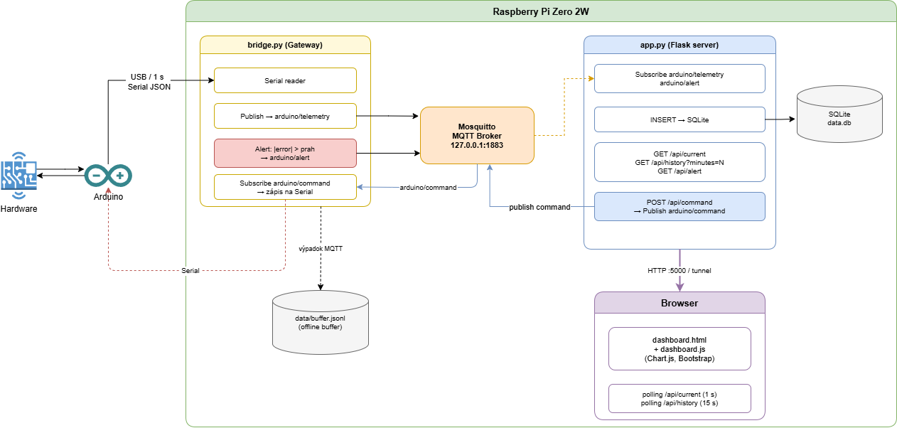

# MISA — Meranie fyzikálnej veličiny s vizualizáciou

Semestrálny projekt predmetu MISA. Systém meria teplotu chladiacej kvapaliny, reguluje Peltierov článok pomocou PID regulátora a vizualizuje namerané dáta v reálnom čase cez webové rozhranie.

> Hardvérová dokumentácia (schémy zapojenia, popis komponentov, montáž) je v [`docs/hardware.md`](docs/hardware.md).

---

## Obsah

- [Popis systému](#popis-systému)
- [Architektúra](#architektúra)
- [Použitý hardvér](#použitý-hardvér)
- [Odôvodnenie technologických volieb](#odôvodnenie-technologických-volieb)
- [Formát prenášaných dát](#formát-prenášaných-dát)
- [Inštalácia](#inštalácia)
- [Prístup na dashboard](#prístup-na-dashboard)
- [Autori](#autori)

---

## Popis systému

Systém simuluje chladenie priemyselného stroja pomocou uzavretého vodného okruhu s Peltierovým článkom. Čerpadlo ženie kvapalinu cez vodný výmenník, ku ktorému je mechanicky pritlačený Peltierov článok (studená strana). Teplá strana je chladená CPU chladičom s ventilátorom. Výhrevné teleso umožňuje vnášať tepelnú poruchu a overovať odozvu regulátora.

Dve teplotné čidlá DS18B20 merajú teplotu kvapaliny **pred** a **za** výmenníkom — ich rozdiel vyjadruje okamžitý tepelný výkon systému. Potenciometer slúži na manuálne ovládanie čerpadla alebo ako demonštrácia analógového snímača kategórie B.

PID regulátor bežiaci na Arduine udržuje teplotu „studenej" vody na nastavenej hodnote riadením PWM výkonu Peltierovho článku. Telemetria je každú sekundu odosielaná cez sériovú linku na Raspberry Pi, kde ju `bridge.py` publikuje cez MQTT. Flask server (`app.py`) správy odberie, uloží do SQLite databázy a sprístupní cez webový dashboard.

---

## Architektúra




> Schéma zapojenia senzorov: [`docs/obrazky/schema.jpg`](docs/obrazky/schema.jpg)

---

## Použitý hardvér

| Komponent | Kategória | Účel |
|---|---|---|
| Arduino UNO R3 | — | Mikrokontrolér, PID regulátor, PWM výstupy |
| 2× DS18B20 (vodotesné) | **A** — digitálny, 1-Wire | Teplota vody pred a za výmenníkom |
| Potenciometer B10K | **B** — analógový, ADC | Manuálne ovládanie čerpadla / analógový snímač |
| Snímač prietoku G1/2 | — | Meranie prietoku kvapaliny (l/min) |
| Peltierov článok TEC1-12715 | — | Aktívne chladenie kvapaliny |
| Vodné čerpadlo | — | Cirkulácia kvapaliny v okruhu |
| Výhrevné teleso 50 W / 12 V | — | Simulácia tepelnej záťaže |
| Dual MOSFET PWM AOD4184A ×3 | — | Spínanie výkonových členov cez PWM |
| Raspberry Pi Zero 2W | — | MQTT broker, bridge, Flask server, databáza |
| Napájací zdroj 12 V / 30 A | — | Napájanie výkonových členov |

Podrobný popis komponentov, schéma zapojenia a postup montáže: [`docs/hardware.md`](docs/hardware.md).

---

## Odôvodnenie technologických volieb

### Platforma — Arduino UNO + Raspberry Pi Zero 2W

Arduino UNO bolo zvolené pre dostupnosť, jednoduchosť zapojenia a dostatočný počet PWM výstupov (D9, D10, D11). Raspberry Pi Zero 2W beží ako server — na jedinom zariadení bežia Mosquitto, Flask aj SQLite, čo zjednodušuje nasadenie.

### Snímač kategórie A — DS18B20 (digitálny, 1-Wire)

Vodotesné prevedenie je nevyhnutné pre ponorenie do chladiacej kvapaliny. Protokol 1-Wire umožňuje pripojiť oba snímače na jediný pin Arduina (D2). Presnosť ±0,5 °C je dostatočná pre PID reguláciu teploty vody.

### Snímač kategórie B — Potenciometer B10K (analógový, ADC)

Demonštruje meranie analógovej veličiny cez 10-bitový A/D prevodník Arduina (0–1023). Plní praktickú funkciu: v režime `pumpFromPot = true` nastavuje výkon čerpadla fyzicky, inak sa jeho hodnota iba meria a odosiela ako telemetria. Prevodová charakteristika bola experimentálne zmeraná a linearizovaná po 30° krokoch.

### Komunikačný protokol — MQTT (Mosquitto)

Broker (Mosquitto) beží lokálne na Raspberry Pi a počúva iba na `127.0.0.1:1883`. `bridge.py` a `app.py` sú nezávislé procesy komunikujúce výlučne cez MQTT — výpadok jedného procesu neovplyvní druhý. `bridge.py` pri výpadku MQTT bufferuje telemetriu lokálne do `data/buffer.jsonl` a po obnovení spojenia dáta doplní.

### Databáza — SQLite

Ľahká bezseverová databáza bez závislostí vhodná pre objem dát projektu (≈ 86 400 záznamov/deň). Schéma je inicializovaná automaticky pri štarte `app.py`. História je dostupná cez `/api/history?minutes=N`.

### Vizualizácia — vlastný Flask dashboard

Vlastný webový dashboard (Flask + Vanilla JS + Chart.js) bol zvolený pre plnú kontrolu nad zobrazením. Dashboard sa aktualizuje každú sekundu (`/api/current`), história grafov každých 15 sekúnd (`/api/history`). Príkazy na Arduino (setpoint, PID parametre, PWM) sa odosielajú cez `POST /api/command`.

### Perióda merania — 1 sekunda

Voda má vysokú tepelnú zotrvačnosť. Perióda 1 s je dostatočná pre PID reguláciu a nezahlcuje sériovú linku ani MQTT broker. Hodnota je viazaná na PID parameter `T = 1.0` cez konštantu `SAMPLE_PERIOD_MS`.

---

## Formát prenášaných dát

### Telemetria — Arduino → bridge.py → `arduino/telemetry` (každú sekundu)

```json
{
  "cold": 18.5,
  "warm": 34.2,
  "setpoint": 22.0,
  "peltier_pwm": 180,
  "pump_pwm": 128,
  "heater_pwm": 50,
  "resistance": 512,
  "pump_from_pot": false,
  "flow_rate_lpm": 1.23,
  "total_ml": 4560,
  "error": -3.500,
  "P_term": -210.00,
  "I_term": -35.00,
  "D_term": 0.00,
  "Kp": 60.00,
  "Ki": 10.00,
  "Kd": 0.00
}
```

| Kľúč | Typ | Popis |
|---|---|---|
| `cold` | `float \| null` | Teplota vstupnej vody (°C), `null` ak senzor odpojený |
| `warm` | `float \| null` | Teplota výstupnej vody (°C) |
| `setpoint` | `float` | Cieľová teplota pre PID |
| `peltier_pwm` | `int` (0–255) | Aktuálny PWM Peltiera |
| `pump_pwm` | `int` (0–255) | Aktuálny PWM čerpadla |
| `heater_pwm` | `int` (0–255) | PWM výhrevného telesa |
| `resistance` | `int` (0–1023) | Surová ADC hodnota potenciometra |
| `pump_from_pot` | `bool` | `true` = čerpadlo riadi potenciometer |
| `flow_rate_lpm` | `float` | Aktuálny prietok (l/min) |
| `total_ml` | `int` | Celkové pretečené množstvo (ml) |
| `error` | `float` | Regulačná odchýlka PID |
| `P_term`, `I_term`, `D_term` | `float` | Zložky PID výstupu |
| `Kp`, `Ki`, `Kd` | `float` | Aktuálne PID parametre |

### Alert — bridge.py → `arduino/alert`

Publikovaný automaticky ak `|error| > ALERT_ERROR_THRESHOLD` (predvolene 5,0 °C).

```json
{
  "type": "setpoint_deviation",
  "error": -6.2,
  "cold": 28.2,
  "setpoint": 22.0,
  "ts": 1718000000
}
```

### Príkazy — `POST /api/command` → `arduino/command` → Arduino

| Príkaz | Rozsah | Popis |
|---|---|---|
| `{"pumpPWM": 200}` | 0–255 | Nastaví PWM čerpadla softvérovo |
| `{"pumpPWM": -1}` | — | Prepne čerpadlo na potenciometer |
| `{"heaterPWM": 50}` | 0–255 | Nastaví PWM výhrevného telesa |
| `{"setpoint": 25.0}` | float | Zmení cieľovú teplotu PID |
| `{"Kp": 120.0}` | float | Proporcionálne zosilnenie |
| `{"Ki": 3.5}` | float | Integračné zosilnenie (resetuje integrál) |
| `{"Kd": 0.0}` | float | Derivačné zosilnenie |
| `{"reset": 1}` | — | Resetuje PID integrál a predchádzajúcu chybu |

---

## Inštalácia

### Požiadavky

- Raspberry Pi OS Lite (64-bit), Python 3.11+
- Mosquitto MQTT broker
- Arduino IDE 2.x (na nahratie firmvéru)

---

### 1. Arduino firmware

```bash
# Firmware pre arduino sa nachádza firmware/main/main.ino a je nutné ho nahrať pomocou Arduino IDE

```
#### 1.1 Systémové závislosti
- `OneWire` — Paul Stoffregen
- `DallasTemperature` — Miles Burton

---

### 2. Raspberry Pi

#### 2.1 Systémové závislosti
Pred inštaláciou odporúčame vytvoriť špeciálny environment pre tento projekt.

```bash
sudo apt update && sudo apt install -y mosquitto python3-pip python3-venv
```

#### 2.2 Konfigurácia Mosquitto

```bash
sudo cp server/misa.conf /etc/mosquitto/conf.d/misa.conf
sudo systemctl restart mosquitto
```

Broker bude počúvať na `127.0.0.1:1883` (lokálne, bez autentifikácie).

#### 2.3 Python závislosti

```bash
cd /home/pi/stu-project
python3 -m venv .venv
source .venv/bin/activate
pip install -r server/requirements.txt
```

#### 2.4 Konfigurácia prostredia

Vytvorte súbor `/home/pi/stu-project/.env` podľa šablóny:

```env
# Sériová linka
SERIAL_PORT=/dev/ttyACM0
SERIAL_BAUD=9600

# MQTT
MQTT_HOST=localhost
MQTT_PORT=1883
TOPIC_TELEMETRY=arduino/telemetry
TOPIC_COMMAND=arduino/command
TOPIC_ALERT=arduino/alert

# Flask
FLASK_HOST=0.0.0.0
FLASK_PORT=5000
FLASK_DEBUG=false

# Databáza
DB_PATH=server/data.db

# Alert prah (°C)
ALERT_ERROR_THRESHOLD=5.0
```

> Správny port (`/dev/ttyACM0` alebo `/dev/ttyUSB0`) zistíte príkazom `ls /dev/tty*`

#### 2.5 Systemd služby

```bash
sudo cp server/misa-bridge.service /etc/systemd/system/
sudo cp server/misa-server.service /etc/systemd/system/
sudo systemctl daemon-reload
sudo systemctl enable --now misa-bridge
sudo systemctl enable --now misa-server
```

Overenie stavu:

```bash
sudo systemctl status misa-bridge
sudo systemctl status misa-server
journalctl -u misa-bridge -f   # live logy bridge
journalctl -u misa-server -f   # live logy server
```

---

## Prístup na dashboard

| Služba | URL |
|---|---|
| Webový dashboard | `http://localhost:5000` |
| API — aktuálne dáta | `http://localhost:5000/api/current` |
| API — história (posledných x minút) | `http://localhost:5000/api/history?minutes=60` |


---

## Autori

- **Igor Najšel**
- **Matúš Matuška**
- **Tomáš Ondrišák**