# Riadenie teploty pomocou Peltierovho článku - popis komponentov a činnosti modelu

## 1. Cieľ projektu

Cieľom projektu je vytvoriť model chladiaceho systému, ktorý simuluje chladenie strojov vo výrobe. Chladenie je realizované pomocou Peltierovho modulu, vodného výmenníka a kvapaliny, ktorá je poháňaná čerpadlom. Súčasťou projektu je aj monitorovanie fyzikálnych veličín, ich odosielanie, ukladanie do databázy a následná vizualizácia.

Akčné členy systému, konkrétne Peltierov modul, čerpadlo a topné teliesko, sú riadené pomocou PWM signálu cez MOSFET moduly. Riadenie zabezpečuje mikrokontrolér Arduino, ktorý zároveň spracováva merané fyzikálne veličiny. V systéme sa meria teplota vody pred a za výmenníkom, prietok vody a hodnota z potenciometra ako analógového snímača.

Čerpadlo môže byť riadené dvoma spôsobmi. V prvom režime je jeho výkon nastavovaný na základe hodnoty odporu potenciometra. V druhom režime sa hodnota potenciometra iba meria a odosiela ako analógová veličina, pričom výkon čerpadla je nastavovaný softvérovo.

Arduino komunikuje cez sériovú linku s Raspberry Pi, ktoré namerané údaje ďalej odosiela pomocou protokolu MQTT. Údaje sú následne ukladané do databázy a zobrazované vo vizualizačnom rozhraní. Regulácia teploty je realizovaná pomocou Peltierovho modulu, teda systém aktívne chladí kvapalinu. Na riadenie teploty je použitý PID regulačný algoritmus.

## 2. Princíp činnosti zariadenia

Zariadenie pracuje ako zjednodušený model chladiaceho systému používaného pri chladení strojov vo výrobe. Kvapalina je pomocou čerpadla prečerpávaná cez vodný okruh, v ktorom sa nachádza výmenník tepla. Na výmenník je pripevnený Peltierov modul, ktorý slúži ako aktívny chladiaci prvok.

Peltierov modul pri napájaní jednosmerným prúdom vytvára teplotný rozdiel medzi svojimi stranami. Jedna strana modulu sa ochladzuje a druhá strana sa zohrieva. Studená strana je spojená s vodným výmenníkom, cez ktorý preteká kvapalina. Tým dochádza k odoberaniu tepla z kvapaliny. Teplá strana Peltierovho modulu je pripevnená na CPU AMD chladič, ktorý odvádza vzniknuté teplo do okolia. Na zlepšenie prestupu tepla je medzi jednotlivými plochami použitá teplovodivá pasta. Teplotný rozdiel je viditeľný a to tak, že je monitorovaná teplota chladiacej kvapaliny pred a za výmenníkom. Jednotlivé snímače sú označené červenou a modrou farbou.

Na vytvorenie tepelnej záťaže je v systéme použité topné teliesko. To umožňuje simulovať zahrievanie kvapaliny alebo vznik tepla, podobne ako pri reálnom stroji. Výkon Peltierovho modulu, čerpadla a topného telieska je riadený pomocou PWM signálu cez MOSFET moduly. Mikrokontrolér Arduino generuje riadiace signály a zároveň spracováva údaje zo snímačov.

V systéme sa meria teplota vody, prietok vody a hodnota z potenciometra. Potenciometer slúži aj na nastavovanie výkonu čerpadla, alebo iba ako meraný analógový snímač. Namerané údaje Arduino odosiela cez sériovú linku do Raspberry Pi. Raspberry Pi tieto údaje následne odosiela pomocou protokolu MQTT, ukladá ich do databázy a umožňuje ich vizualizáciu.

Regulácia teploty je realizovaná pomocou PID algoritmu. Regulačný algoritmus porovnáva požadovanú teplotu so skutočne nameranou teplotou vody a podľa vzniknutej regulačnej odchýlky nastavuje výkon Peltierovho modulu. Systém teda teplotu aktívne znižuje chladením, pričom topné teliesko slúži hlavne na vytvorenie záťaže alebo poruchy v systéme.

*Obr. 1: Schéma zapojenia zariadenia*

Zapojenie systému pozostáva z riadiacej, meracej a výkonovej časti. Riadiacu časť tvorí mikrokontrolér Arduino, ktorý spracováva údaje zo snímačov a generuje PWM signály pre výkonové členy. Meraciu časť tvoria teplotné snímače DS18B20, snímač prietoku a potenciometer. Výkonovú časť tvoria MOSFET moduly, cez ktoré sú ovládané Peltierov modul, čerpadlo a topné teliesko.

### 3.1 Použité piny Arduina

| Prvok | Presný typ / modul | Pin Arduina | Typ signálu | Popis |
|---|---|---:|---|---|
| Teplotné snímače | DS18B20 | D2 | digitálna komunikácia | Meranie teploty vody pred a za výmenníkom |
| Snímač prietoku | Snímač prietoku tekutiny G1/2 | D3 | digitálny vstup / interrupt | Meranie impulzov zo snímača prietoku |
| Peltierov modul | TEC1-12715 cez Dual MOSFET PWM regulátor AOD4184A | D10 | PWM výstup | Riadenie výkonu Peltierovho modulu |
| Čerpadlo | Čerpadlo cez Dual MOSFET PWM regulátor AOD4184A | D11 | PWM výstup | Riadenie výkonu čerpadla |
| Topné teliesko | Topné teliesko 50 W cez Dual MOSFET PWM regulátor AOD4184A | D9 | PWM výstup | Riadenie výkonu topného telieska |
| Potenciometer | B10K | A0 | analógový vstup | Meranie hodnoty potenciometra |
| Sériová linka | USB / UART | USB | sériová komunikácia | Komunikácia medzi Arduinom a Raspberry Pi |

Na spínanie výkonových členov sú použité MOSFET PWM moduly s tranzistormi typu AOD4184A. Tieto moduly umožňujú riadiť väčšie prúdy pomocou PWM signálu z Arduina, pričom Arduino slúži iba ako riadiaca časť a výkonové prvky sú napájané zo samostatného zdroja.

### 3.2 Detailný popis zapojenia komponentov

Teplotné snímače DS18B20 sú pripojené na spoločnú digitálnu zbernicu. Čierny vodič snímačov je pripojený na GND, červený vodič na napájanie VCC a žltý vodič slúži ako dátový vodič. Dátový vodič je pripojený na digitálny pin D2 Arduina. Medzi dátovým vodičom a napájaním VCC je zapojený rezistor s hodnotou 4,7 kΩ, ktorý slúži ako pull-up rezistor pre dátovú zbernicu.

Snímač prietoku vody je pripojený na napájanie VCC (červený vodič) a GND (čierny vodič). Jeho signálový výstup je pripojený na digitálny pin D3 Arduina. Tento pin je použitý ako vstup pre počítanie impulzov zo snímača prietoku. V programe je na tomto pine použité prerušenie, vďaka čomu je možné presnejšie počítať impulzy vznikajúce pri prietoku vody. Na základe počtu impulzov za jednu vzorkovaciu periódu sa vypočítava aktuálny prietok vody v litroch za minútu a celkové pretečené množstvo vody.

PWM MOSFET moduly s tranzistormi AOD4184A sú použité na riadenie výkonových členov systému. Na vstupy MOSFET modulov sú privedené PWM signály z Arduina. Peltierov modul je riadený z pinu D10, čerpadlo z pinu D11 a topné teliesko z pinu D9. Výstupy z Arduina sú chránené rezistormi s hodnotou 4,7 kΩ, ktoré obmedzujú prúd do riadiacich vstupov MOSFET modulov. Výkonové členy nie sú napájané priamo z Arduina, ale zo samostatného napájacieho zdroja.

Potenciometer je pripojený ako analógový delič napätia. Stredná nožička potenciometra je pripojená na analógový vstup A0 Arduina. Krajné nožičky potenciometra sú pripojené na VCC a GND. Pri otáčaní potenciometra sa mení napätie na strednej nožičke, ktoré Arduino meria pomocou A/D prevodníka v rozsahu 0 až 1023. Z nameranej hodnoty sa následne vypočítava približná hodnota odporu potenciometra.

Potenciometer môže byť použitý dvoma spôsobmi. V prvom režime slúži na nastavovanie výkonu čerpadla. V druhom režime sa hodnota potenciometra iba meria a odosiela ako analógová veličina, pričom výkon čerpadla je nastavovaný softvérovo.

Arduino a výkonová časť systému musia mať spoločnú zem. To znamená, že GND Arduina musí byť prepojené s GND napájacieho zdroja pre Peltierov modul, čerpadlo a topné teliesko. Spoločná zem je potrebná na správne vyhodnocovanie riadiacich PWM signálov.

### 3.3 Komunikácia s Raspberry Pi

Arduino komunikuje s Raspberry Pi cez sériovú linku. Namerané hodnoty a aktuálne stavy systému sú odosielané vo formáte JSON. Raspberry Pi tieto údaje ďalej spracováva, odosiela pomocou MQTT, ukladá do databázy a umožňuje ich vizualizáciu.

## 4. Popis použitých komponentov

V tejto kapitole sú popísané hlavné komponenty použité pri zostavení modelu. Pri výbere komponentov sa bral do úvahy najmä účel projektu, dostupnosť, cena, jednoduché zapojenie a možnosť riadenia pomocou mikrokontroléra Arduino.

### 4.1 Senzory a snímače

#### Teplotné snímače DS18B20

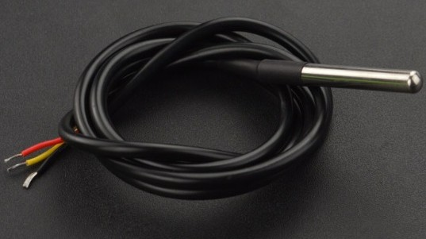

*Obr. 2: Vodotesné teplotné snímače DS18B20*

Na meranie teploty chladiacej kvapaliny boli použité vodotesné digitálne snímače DS18B20. Zvolili sme ich preto, že sú vhodné na meranie teploty kvapaliny, majú jednoduché zapojenie a umožňujú pripojiť viac snímačov na jednu dátovú zbernicu. V projekte sú použité dva snímače, jeden pred výmenníkom a druhý za výmenníkom, čo umožňuje sledovať teplotný rozdiel chladiacej kvapaliny.

Výhodou snímačov DS18B20 je ich vodotesné puzdro a jednoduchá komunikácia s Arduinom. Nevýhodou je pomalšia odozva oproti niektorým iným typom teplotných snímačov, čo však pri tomto modeli nepredstavuje zásadný problém.

Teplotné snímače sú vložené do T-spojok kúpených v OBI. T-spojky boli zvolené preto, že svojím vnútorným priemerom vhodne pasovali na použité teplotné snímače. Pri návrhu podobného systému je potrebné prispôsobiť rozmery T-spojok, prechodiek, závitov a hadíc konkrétnemu teplotnému snímaču a použitej hadici. V tomto projekte bola použitá hadica s vnútorným priemerom 6 mm.

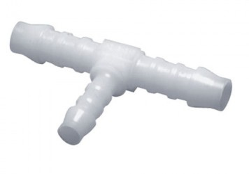

*Obr. 3: T-spojka*

Použitý komponent: [DFRobot vodeodolný senzor teploty DS18B20](https://techfun.sk/produkt/dfrobot-vodeodolny-senzor-teploty-ds18b20/)

#### Snímač prietoku vody

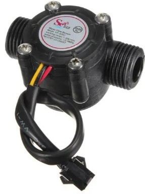

*Obr. 4: Snímač prietoku vody*

Na meranie prietoku chladiacej kvapaliny bol použitý snímač prietoku tekutiny G1/2. Zvolený bol preto, že umožňuje jednoducho merať prietok vody pomocou impulzov, ktoré následne spracováva Arduino. Snímač je pripojený na digitálny vstup s prerušením, vďaka čomu je možné počítať impulzy počas behu programu.

Výhodou snímača je jednoduché zapojenie a možnosť získať údaj o aktuálnom prietoku. Nevýhodou je nižšia citlivosť pri malých prietokoch. Pri nižších výkonoch čerpadla snímač nedokázal spoľahlivo merať prietok, pretože prietok bol príliš malý na jeho presné vyhodnotenie. Pre presnejšie meranie pri nízkych prietokoch by bolo vhodné použiť citlivejší snímač prietoku.

Pri použití snímača je potrebné správne prispôsobiť závity, prechodky a hadice. V projekte bola použitá hadica s vnútorným priemerom 6 mm.

Použitý komponent: [Snímač prietoku tekutiny G1/2](https://techfun.sk/produkt/senzor-prietoku-tekutiny-g1-2/)

#### Potenciometer B10K

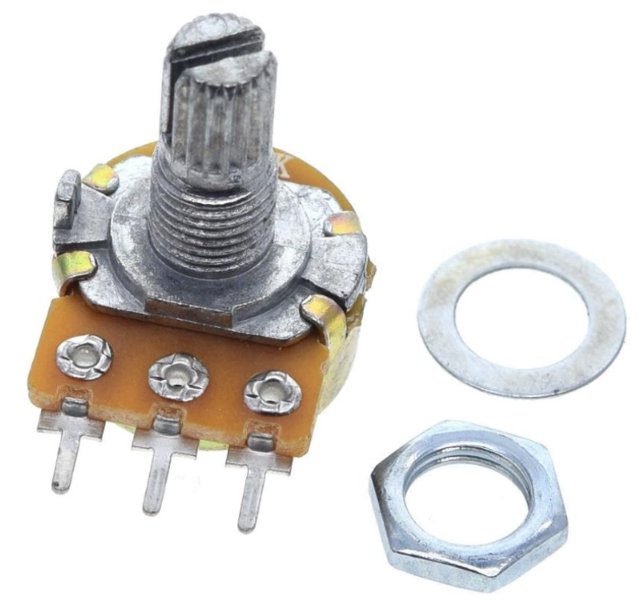

*Obr. 5: Potenciometer B10K*

Potenciometer B10K bol použitý ako analógový snímač. Zvolený bol preto, že umožňuje jednoducho demonštrovať meranie analógovej veličiny pomocou A/D prevodníka Arduina. V projekte môže slúžiť na nastavovanie výkonu čerpadla alebo iba ako meraná analógová veličina, ktorá sa odosiela do systému.

Potenciometer je pripojený ako delič napätia. Stredná nožička potenciometra je pripojená na analógový vstup A0 Arduina a krajné nožičky sú pripojené na VCC a GND. Pri otáčaní potenciometra sa mení napätie na strednej nožičke, ktoré Arduino meria ako hodnotu z A/D prevodníka v rozsahu 0 až 1023.

Pri potenciometri bola experimentálne zmeraná jeho prevodová charakteristika. Meranie bolo vykonané po 30° natočenia potenciometra. Pri každej polohe bola zaznamenaná hodnota z A/D prevodníka Arduina. Cieľom merania bolo zistiť, ako sa mení hodnota snímaná Arduinom v závislosti od natočenia potenciometra.

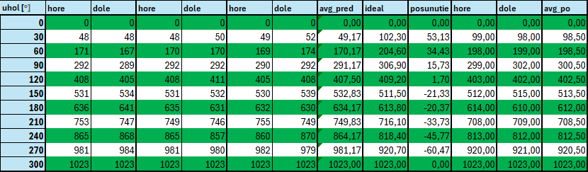

*Obr. 6: Namerané hodnoty prevodovej charakteristiky potenciometra*

*Obr. 7: Graf prevodovej charakteristiky potenciometra*

Z nameraných hodnôt je viditeľné, že charakteristika potenciometra v praktickom zapojení nie je ideálne lineárna. Preto bola pre účely riadenia výkonu čerpadla vytvorená linearizácia charakteristiky. Linearizovaná hodnota sa používa pri prepočte na PWM signál čerpadla, aby zmena výkonu čerpadla viac zodpovedala polohe potenciometra.

Samotná zobrazovaná hodnota odporu potenciometra sa však nelinearizuje. Arduino ju vypočítava na základe aktuálnej hodnoty z A/D prevodníka a maximálneho zmeraného odporu potenciometra. Táto hodnota sa následne odosiela ako meraná analógová veličina.

Maximálna hodnota odporu potenciometra bola zmeraná samostatne pomocou multimetra. Nameraná hodnota bola použitá pri kalibrácii výpočtu odporu v programe, aby Arduino dokázalo zobrazovať čo najpresnejšiu hodnotu odporu potenciometra.

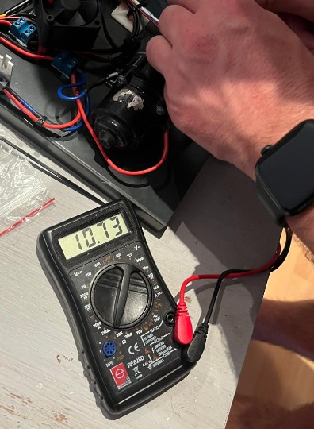

*Obr. 8: Meranie maximálnej hodnoty odporu potenciometra*

Výhodou potenciometra je nízka cena, jednoduché zapojenie a okamžitá zmena hodnoty pri otáčaní. Nevýhodou je nelineárne správanie v praktickom zapojení, mechanické opotrebovanie a nižšia presnosť v porovnaní s priemyselnými snímačmi.

Použitý komponent: [Potenciometer B10K](https://techfun.sk/produkt/potenciometer-rozne-typy-b1k-az-b500k/?attribute_pa_typ-potenciometra=b10k)

### 4.2 Akčné členy

#### Peltierov článok TEC1-12715

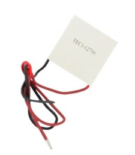

*Obr. 9: Peltierov článok TEC1-12715*

Peltierov článok TEC1-12715 bol zvolený ako hlavný chladiaci prvok systému. Jeho výhodou je možnosť vytvoriť teplotný rozdiel bez použitia kompresora alebo klasického chladiaceho okruhu. Pre školský model je vhodný najmä preto, že sa dá jednoducho riadiť elektricky pomocou PWM signálu cez MOSFET modul.

Nevýhodou Peltierovho článku je pomerne nízka účinnosť a potreba kvalitného odvodu tepla z teplej strany. Ak teplá strana nie je dostatočne chladená, znižuje sa chladiaci výkon celého systému. Dôležitý je aj dobrý mechanický prítlak a použitie teplovodivej pasty medzi Peltierovým článkom, výmenníkom a chladičom.

Použitý komponent: [Peltier článok TEC1-12715](https://techfun.sk/produkt/peltier-clanok/?attribute_pa_peltier=tec1-12715)

#### Vodný výmenník pre Peltierov článok

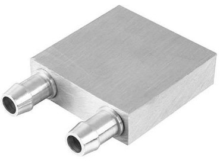

*Obr. 10: Vodný výmenník pre Peltierov článok*

Vodný výmenník slúži na prenos tepla medzi chladiacou kvapalinou a studenou stranou Peltierovho článku. Zvolený bol preto, že umožňuje priamo chladiť kvapalinu v uzavretom vodnom okruhu. Kvapalina preteká cez výmenník a cez jeho steny dochádza k prestupu tepla smerom k Peltierovmu článku.

Výhodou výmenníka je jednoduché použitie s Peltierovým článkom a kompaktné rozmery. Nevýhodou je, že výsledný prestup tepla výrazne závisí od kvality kontaktu medzi výmenníkom a Peltierovým článkom, od prítlaku a od použitia teplovodivej pasty.

Použitý komponent: [Chladič Peltier článkov pre chladenie vodou](https://techfun.sk/produkt/chladic-peltier-clankov-pre-chladenie-vodou/)

#### Čerpadlo

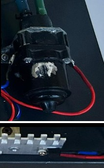

*Obr. 11: Čerpadlo chladiacej kvapaliny*

Čerpadlo zabezpečuje cirkuláciu chladiacej kvapaliny vo vodnom okruhu. Použité bolo čerpadlo zo starého automobilu Opel, najmä z dôvodu dostupnosti a nízkej ceny. Jeho výkon je riadený pomocou PWM signálu cez MOSFET modul.

Výhodou použitého čerpadla je dostatočný výkon pre experimentálny model a veľmi nízka obstarávacia cena. Nevýhodou môže byť neznáma presná charakteristika čerpadla, opotrebovanie a horšia dokumentácia oproti novému laboratórnemu čerpadlu.

#### Ochranná dióda PSR10C40CT pri čerpadle

Pri riadení čerpadla je ako ochranný prvok použitá dióda PSR10C40CT. Čerpadlo predstavuje indukčnú záťaž, ktorá môže pri spínaní a vypínaní vytvárať spätné napäťové špičky. Tieto špičky môžu nepriaznivo pôsobiť na MOSFET modul, preto je dióda použitá ako ochrana výkonového spínacieho prvku.

Súčiastka PSR10C40CT obsahuje dve Schottkyho diódy v jednom púzdre. V zapojení sú využité obe diódy paralelne, čím sa znižuje prúdové zaťaženie jednej diódy a zlepšuje sa schopnosť odvádzať spätný prúd vznikajúci pri spínaní čerpadla.

Výhodou použitia Schottkyho diódy je rýchla odozva a nízky úbytok napätia v priepustnom smere. Nevýhodou je, že pri vyšších prúdoch je potrebné počítať s jej zahrievaním a preto je pripevnená na pasívny hliníkový chladič.

#### Topné teliesko 50 W

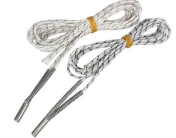

*Obr. 12: Topné teliesko 50 W*

Topné teliesko slúži na vytvorenie tepelnej záťaže v systéme. Zvolené bolo preto, že umožňuje simulovať vznik tepla podobne ako pri reálnom stroji vo výrobe. Vďaka nemu je možné overiť, ako chladiaci systém reaguje na dodané teplo.

Výhodou topného telieska je jednoduché riadenie cez MOSFET modul a dostatočný výkon pre vytvorenie tepelnej poruchy. Nevýhodou je potreba dávať pozor na prehrievanie a správne mechanické uloženie, aby nedošlo k poškodeniu okolitých častí.

Použitý komponent: [Topné teliesko 50 W 12 V](https://techfun.sk/produkt/topne-teliesko-50w-12v-24v-pre-3d-tlaciarne/?attribute_pa_pracovne-napatie=12-v)

### 4.3 Chladenie a pomocné mechanické časti

#### CPU chladič AMD Wraith Stealth

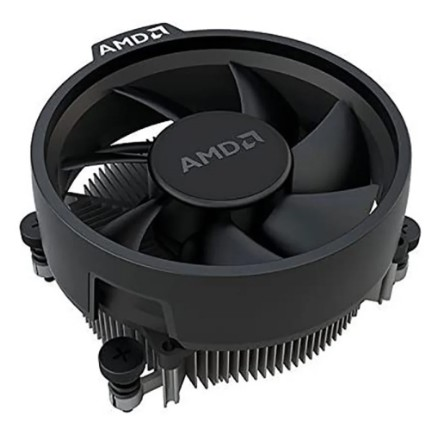

*Obr. 13: CPU chladič AMD Wraith Stealth*

CPU chladič AMD Wraith Stealth slúži na odvádzanie tepla z teplej strany Peltierovho článku. Zvolený bol preto, že bol lacný, dostupný a konštrukčne vhodný na odvod tepla do okolitého vzduchu. V projekte chladí teplú stranu Peltierovho článku, čím nepriamo ovplyvňuje aj účinnosť chladenia výmenníka.

Výhodou chladiča je nízka cena a jednoduchá montáž. Nevýhodou je, že jeho chladiaci výkon môže byť pri silnejšom Peltierovom článku limitujúci. Ak chladič nedokáže odviesť dostatočné množstvo tepla, znižuje sa účinnosť chladenia kvapaliny.

Použitý komponent: [AMD Wraith Stealth chladič CPU](https://www.tsbohemia.sk/amd-wraith-stealth-chladic-cpu_d374817)

#### Ventilátor Arctic S4028-6K

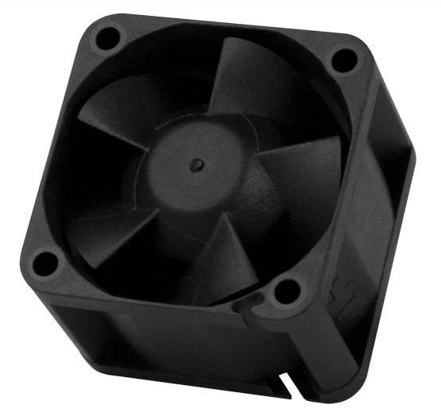

*Obr. 14: Ventilátor Arctic S4028-6K*

Ventilátor Arctic S4028-6K je použitý na chladenie MOSFET modulov. Zvolený bol preto, že výkonové MOSFET moduly sa pri spínaní väčších prúdov zahrievajú a ich dodatočné chladenie zvyšuje spoľahlivosť systému. Ventilátor nie je regulovaný pomocou PWM, ale je napájaný priamo.

Výhodou ventilátora je jednoduché použitie a zlepšenie chladenia výkonových prvkov. Nevýhodou je hlučnosť a ďalšia spotreba elektrickej energie.

Použitý komponent: [Arctic S4028-6K](https://www.alza.sk/arctic-s4028-6k-d7173088.htm)

#### Teplovodivá pasta Arctic MX-4

*Obr. 15: Teplovodivá pasta Arctic MX-4*

Teplovodivá pasta je použitá medzi Peltierovým článkom, vodným výmenníkom a CPU chladičom. Zvolená bola preto, že zlepšuje prestup tepla medzi dotykovými plochami a znižuje tepelný odpor spoja.

Výhodou teplovodivej pasty je jednoduché použitie a zlepšenie tepelného kontaktu. Nevýhodou je, že jej účinnosť závisí od správneho nanesenia a dostatočného mechanického prítlaku medzi komponentmi.

Použitý komponent: [Arctic MX-4 teplovodivá pasta](https://www.conrad.sk/sk/p/arctic-mx-4-actcp00024a-teplovodiva-pasta-45-g-2841652.html)

#### Hadicové prechodky

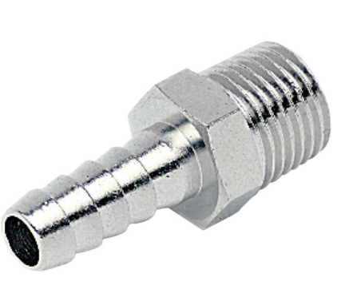

*Obr. 16: Hadicová prechodka*

Hadicové prechodky slúžia na pripojenie hadíc k jednotlivým častiam vodného okruhu. Zvolené boli podľa použitej hadice a závitov jednotlivých komponentov. V tomto projekte bola použitá hadica s vnútorným priemerom 6 mm.

Pri návrhu podobného systému je potrebné rozmery prechodiek, závitov a hadíc voliť podľa konkrétneho vodného výmenníka, snímača prietoku, T-spojok a teplotných snímačov. Nesprávne zvolené rozmery môžu spôsobiť netesnosti alebo problematickú montáž.

Použitý komponent: [Hadicová priechodka 1/8, priemer 6 mm](https://www.conrad.sk/sk/p/ich-hadicova-priechodka-30402-vonkajsi-zavit-1-8-priemer-6-mm-1-ks-584915.html)

### 4.4 Riadiace a výkonové prvky

#### Arduino UNO R3

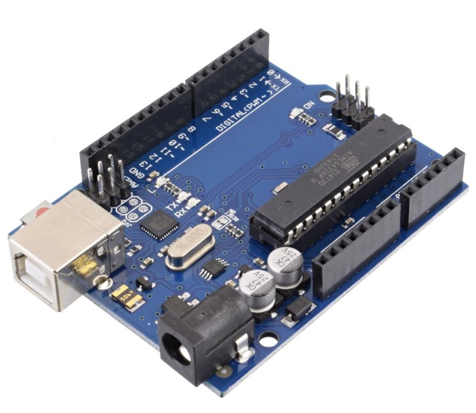

*Obr. 17: Arduino UNO R3*

Arduino UNO R3 je použité ako hlavný mikrokontrolér systému. Spracováva údaje zo snímačov, vykonáva PID regulačný algoritmus a generuje PWM signály pre výkonové členy. Zároveň komunikuje cez sériovú linku s Raspberry Pi.

Zvolené bolo najmä pre jednoduché zapojenie, dostupnosť, nízku cenu a dostatočný počet vstupov a výstupov pre tento model. Nevýhodou použitého Arduina je, že nemá zabudovanú WiFi komunikáciu. Z tohto dôvodu je v aktuálnej verzii použitá sériová komunikácia s Raspberry Pi. Bezdrôtový prenos údajov by bolo možné doplniť použitím mikrokontroléra s WiFi, napríklad ESP32, alebo doplnením vhodného komunikačného modulu.

Použitý komponent: [Arduino UNO R3 presný klon](https://techfun.sk/produkt/arduino-uno-r3-precizny-klon/)

#### Dual MOSFET PWM modul AOD4184A

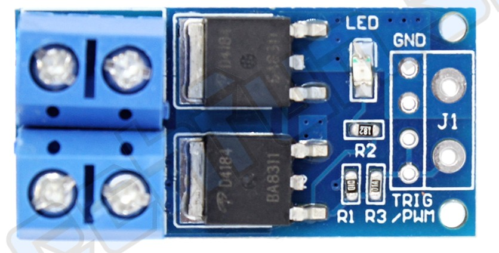

*Obr. 18: Dual MOSFET PWM modul AOD4184A*

Dual MOSFET PWM modul AOD4184A je použitý na spínanie a riadenie výkonových členov. Arduino na jeho vstupy posiela PWM signály a MOSFET modul následne spína výkonové prvky napájané zo samostatného zdroja.

Zvolený bol preto, že Arduino nedokáže priamo spínať väčšie prúdy potrebné pre Peltierov článok, čerpadlo a topné teliesko. Výhodou MOSFET modulu je jednoduché pripojenie k Arduinu a možnosť riadiť vyššie prúdy pomocou malého riadiaceho signálu. Nevýhodou je zahrievanie pri vyššej záťaži, preto sú MOSFET moduly dodatočne chladené ventilátorom.

Použitý komponent: [Dual MOSFET PWM regulátor AOD4184A](https://techfun.sk/produkt/dual-mosfet-pwm-regulator-aod4184a/)

#### Spínaný napájací zdroj 12 V / 30 A / 360 W

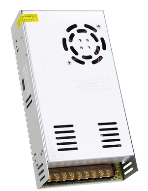

*Obr. 19: Spínaný napájací zdroj 12 V / 30 A / 360 W*

Na napájanie systému je použitý spínaný napájací zdroj s výstupným napätím 12 V, maximálnym prúdom 30 A a výkonom 360 W. Zdroj napája výkonové časti systému, najmä Peltierov článok, čerpadlo, topné teliesko a ventilátory.

Zvolený bol preto, že použitý Peltierov článok a ďalšie akčné členy môžu odoberať vyšší prúd. Výhodou zdroja je dostatočná výkonová rezerva pre celý systém. Nevýhodou je potreba dbať na správne zapojenie, istenie a bezpečnú manipuláciu, pretože zdroj dokáže dodať vysoký prúd.

Použitý komponent: [Spínaný napájací zdroj 12 V / 360 W](https://techfun.sk/produkt/spinany-napajaci-zdroj-12v/?attribute_pa_vykon=360w)

### 4.5 Poznámka ku komunikácii

Pôvodným zámerom bolo realizovať prenos údajov bezdrôtovo pomocou WiFi. V aktuálnej verzii projektu je však použitá sériová komunikácia medzi Arduinom a Raspberry Pi. Toto riešenie bolo zvolené z dôvodu jednoduchšej implementácie, vyššej stability pri testovaní a použitia dostupného mikrokontroléra Arduino UNO R3, ktorý nemá zabudovaný WiFi modul.

Bezdrôtový prenos údajov je možné v budúcnosti doplniť napríklad použitím mikrokontroléra ESP32 alebo pridaním samostatného WiFi modulu. Funkčnosť monitorovania, odosielania údajov, ukladania do databázy a vizualizácie však zostáva zachovaná, keďže Arduino odosiela údaje do Raspberry Pi cez sériovú linku a Raspberry Pi ich následne ďalej spracováva.

## 5. Montáž zariadenia

Montáž zariadenia prebiehala postupne od mechanickej časti, cez osadenie vodného okruhu až po elektrické zapojenie výkonových a riadiacich prvkov. Pri montáži bolo potrebné prispôsobiť viacero častí konkrétnym rozmerom použitých komponentov, najmä hadiciam, priechodkám, snímačom teploty a vodnému výmenníku.

Najskôr boli pripravené mechanické časti vodného okruhu. Do kovovej nádoby boli vytvorené otvory pre hadicové priechodky. Rozmery otvorov bolo potrebné prispôsobiť použitým priechodkám a hadici s vnútorným priemerom 6 mm. Pri montáži bolo dôležité zabezpečiť tesnosť spojov, aby nedochádzalo k úniku chladiacej kvapaliny.

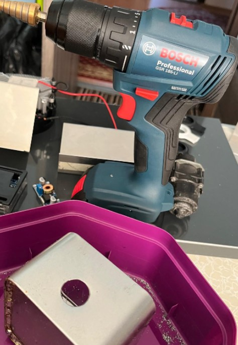

*Obr. 20: Vytváranie otvoru pre hadicovú priechodku*

Teplotné snímače boli vložené do T-spojok, ktoré boli následne zapojené do vodného okruhu. T-spojky boli zvolené podľa rozmerov použitých snímačov a hadíc. Tento spôsob uloženia umožňuje merať teplotu chladiacej kvapaliny priamo v prietoku.

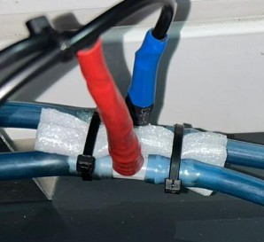

*Obr. 21: Uloženie teplotného snímača do T-spojky*

Peltierov článok bol umiestnený medzi vodný výmenník a CPU chladič. Medzi jednotlivé styčné plochy bola nanesená teplovodivá pasta, aby sa zlepšil prestup tepla. Celá zostava bola mechanicky stiahnutá pomocou skrutiek a prítlačných častí, pretože dostatočný prítlak je pri Peltierovom článku dôležitý pre správnu funkciu chladenia.

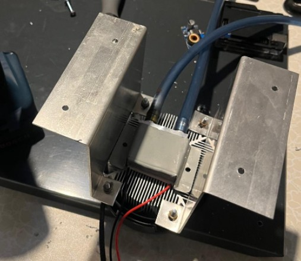

*Obr. 21: Uchytenie Peltierovho článku medzi výmenník a chladič*

Následne boli osadené MOSFET moduly, ktoré slúžia na spínanie výkonových členov. Pri čerpadle bola doplnená ochranná Schottkyho dióda PSR10C40CT, pričom boli využité obe diódy paralelne. Táto dióda slúži na obmedzenie spätných napäťových špičiek vznikajúcich pri spínaní indukčnej záťaže.

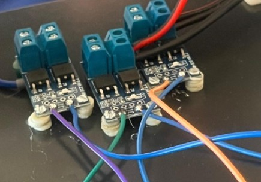

*Obr. 22: Zapojenie MOSFET modulov a výkonovej časti*

Potenciometer bol použitý ako analógový snímač. Pre meranie jeho prevodovej charakteristiky bola pripravená jednoduchá uhlová stupnica po 30°. Pri jednotlivých polohách sa zaznamenávali hodnoty z A/D prevodníka Arduina, ktoré boli následne použité na linearizáciu hodnoty pri riadení čerpadla.

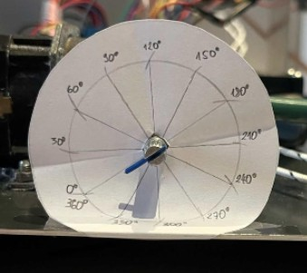

*Obr. 23: Meranie prevodovej charakteristiky potenciometra*

Na napájanie výkonových členov bol použitý spínaný zdroj 12 V / 30 A / 360 W. Výkonové prvky neboli napájané priamo z Arduina, ale zo samostatného zdroja cez MOSFET moduly. Arduino, MOSFET moduly a napájací zdroj museli mať spoločnú zem, aby bolo možné správne vyhodnocovať PWM riadiace signály.

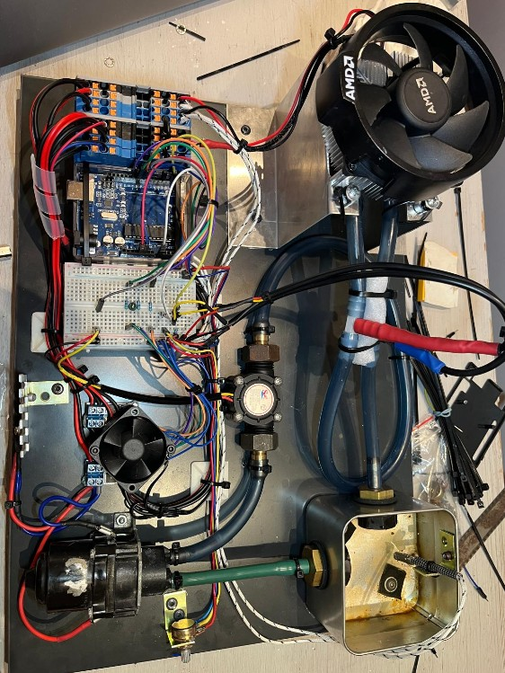

*Obr. 24: Finálne zapojenie a skonštrovanie zariadenia*

Zvyšné fotky Fotodokumentácie montáže sú súčasťou repozitára projektu. Obsahuje pracovné fotografie z prípravy otvorov, osádzania priechodiek, montáže Peltierovho článku, zapojenia MOSFET modulov a testovania vodného okruhu.